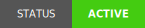

= Guidelines Standard

== Version
Version:: v0.1.0
Status:: Active
Date:: 2025-05-30

This guideline is created according to the
https://github.com/kober-systems/guidelines/published/guidelines_standard_v0-1-0.adoc["Guidelines
Standard" v0.1.0].

== Overview
For efficient workflows unified structures are necessary. This makes it
easier to navigate in a project. It also flattens the learning curve for
new users. Furthermore, it makes the processes in projects controllable
and automatable, which improves both quality and processing speed.

These structures are defined by guidelines. To make these guidelines
easy to read, modify, and understand, this document specifies how they
must be structured.

=== Goals
For guidelines to contribute to quality improvement, they must meet some
basic prerequisites:

* They must be *unambiguous*. To achieve this, it is essential to
  maintain a formal language.
* They must be *traceable*. To do this, it is crucial to justify
  decisions.
* They must *never be circumvented*, but should be very *easy for
  everyone to modify*. This avoids the risk that everything will develop
  wildly, but at the same time, you will not be permanently trapped in
  cumbersome or unnecessary specifications.

The requirements specified in this document attempt to secure these
characteristics or provide tools to achieve them.

== Requirements

=== Language Conventions
Each requirement MUST be formulated unambiguously using the words
defined in the following list. These words MUST be written in uppercase
letters. A sentence without this special notation is not considered a
requirement, but a comment.

MUST, SHALL, REQUIRED:: If one of these words is used, the requirement
  is mandatory.
MUST NOT, SHALL NOT:: These expressions mark a mandatory prohibition.
SHOULD, RECOMMENDED:: If one of these words is used, it indicates
  a recommendation that should be implemented whenever possible. If you
  decide against it, the decision should be justified and documented.
SHOULD NOT:: Indicates something that is strongly discouraged. If you do
  it nonetheless, it should be justified and documented.
CAN, MAY, OPTIONAL:: These words indicate a possibility or suggestion
  that may be applied sometimes. Sentences marked with these words do
  not have to be implemented.

This means the key words "MUST", "MUST NOT", "REQUIRED",
"SHALL", "SHALL NOT", "SHOULD", "SHOULD NOT", "RECOMMENDED",
"MAY", and "OPTIONAL" are to be interpreted as described in
https://datatracker.ietf.org/doc/html/rfc2119[RFC 2119].

=== Structure
Each guideline MUST have a title, which is used as a heading.

Each guideline MUST have the following subheadings (in this order):

* Version
* Overview
** Goals
* Requirements
* Possible Problems

Additional structure points MAY be added as needed.

=== Versioning
Each guideline MUST specify a version number. This version number MUST
be unique. This version number MUST consist of three numbers separated
by dots.

If a requirement is changed or removed, the first of the three digits
(major) MUST be incremented.

If a new requirement is added, the second digit (minor) MUST be
incremented.

If only an explanation is added or the formulation is changed, the third
digit (patch) MUST be incremented.

This principle corresponds to
https://semver.org/spec/v2.0.0.html[semantic versioning].

Under the "Version" heading, the following entries MUST be made
(REQUIRED):

[source, asciidoc]
----
Version::...
Status::...
Date::...

This guideline is created according to the "Guidelines Standard" v0.1.0.
----

The date is always the last editing date (REQUIRED).

The status MUST be one of the following words:

Draft:: The guideline is not yet used, but is proposed as the next active
  version (e.g., because it fixes weaknesses of the current version).
Active:: The guideline is the currently active standard, and all new
  processes should implement it.
Deprecated:: The guideline is no longer active, but there are still
  projects or processes that have not been updated to a newer guideline.
  New projects should not be implemented according to this guideline.
Retried:: The guideline is no longer valid, and there are no more known
  projects or processes that reference it.

Whenever the document is edited, the version number MUST be incremented,
and the editing date MUST be updated. The exception to this requirement
is when the status of a document changes. If only the status changes,
the version number MUST NOT be changed.

References to other guidelines MAY be appended at the end of the
paragraph under the "Version" heading.

=== Storage
In a folder for guidelines, other kinds of documents MUST NOT be
stored. The term "folder" MAY refer to any tree structure (e.g.,
linked web pages). This folder MUST contain a subfolder "published".
In this folder, all guidelines with an additional postfix for the
version number MUST be stored. The filename has the following format:
`<title>_v<major>-<minor>-<patch>.<file extension>` (REQUIREMENT).

Only guidelines with the status "Draft" or "Active" may be stored
directly in the guidelines folder (REQUIREMENT). Guidelines with
the status "Draft" MUST be stored in this folder with the filename
`draft-<title>.<file extension>`. Guidelines with the status "Active"
MUST be stored in this folder with the filename `<title>.<file
extension>`.

All special characters in the filename MUST be replaced with ASCII
characters. All spaces MUST be replaced with `_`.

The current version MUST also be stored in the "published" subfolder.
This MAY be realized using a symbolic link. In any case, it MUST be
ensured that the corresponding version in the archive for published
versions and the current version in the guidelines folder are identical.

For guidelines with the same title, only one combination of major and
minor version may have the status "Active" (REQUIREMENT). There MAY be
multiple patch versions that are "Active" (but only one of them can be in
the main folder).

There SHOULD be a maximum of one version of a guideline that has the
status "Draft".

Guidelines MUST NOT be deleted if they have the status "Active" or
"Deprecated".

== Possible Problems
Theoretically, version numbers can overlap if multiple drafts exist or
a draft becomes deprecated or retried without replacing the active
standard. However, these are scenarios that should not occur in practice
and will only be addressed if it becomes apparent that they frequently
cause problems.

